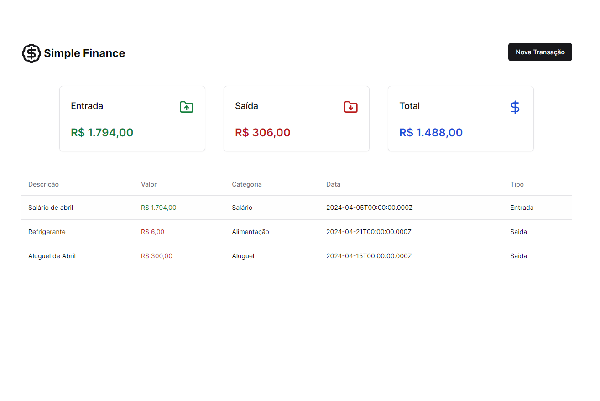

# Simple Finance



## Descrição

Simple Finance é um aplicativo web simples desenvolvido em Next.js, Prisma, SQLite, Shadcn/UI, Tailwind e TypeScript, projetado para ajudar na gestão de despesas pessoais. Com uma interface limpa e intuitiva, os usuários podem facilmente registrar e acompanhar suas despesas diárias, analisar seus gastos e manter um controle financeiro eficaz.

## Instalação

Siga estas etapas para configurar e executar o Simple Finance localmente:

1. **Clone o repositório:**

    ```bash
    git clone https://github.com/mateushsx/simple-finance.git
    ```

2. **Instale as dependências:**

    Certifique-se de ter o Node.js e o npm instalados em sua máquina.

    ```bash
    cd simple-finance
    npm install
    ```

3. **Configure o banco de dados:**

    Renomeie o arquivo `.env.example` para `.env` e insira as configurações do banco de dados SQLite.

4. **Execute as migrações do banco de dados:**

    ```bash
    npx prisma migrate dev
    ```

5. **Inicie o servidor de desenvolvimento:**

    ```bash
    npm run dev
    ```

6. **Acesse o aplicativo:**

    Abra o navegador e acesse `http://localhost:3000`.

## Contribuindo

Contribuições são bem-vindas! Se você deseja melhorar o Simple Finance, sinta-se à vontade para enviar pull requests ou abrir issues para discutir novos recursos, problemas ou ideias.

## Licença

Este projeto é licenciado sob a [Licença MIT](LICENSE).
